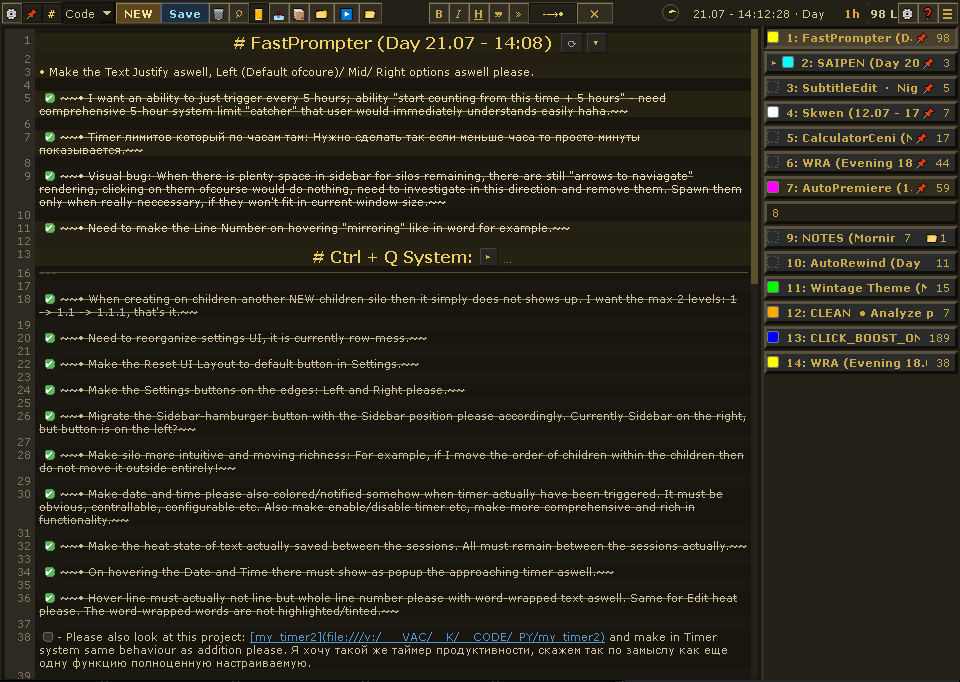
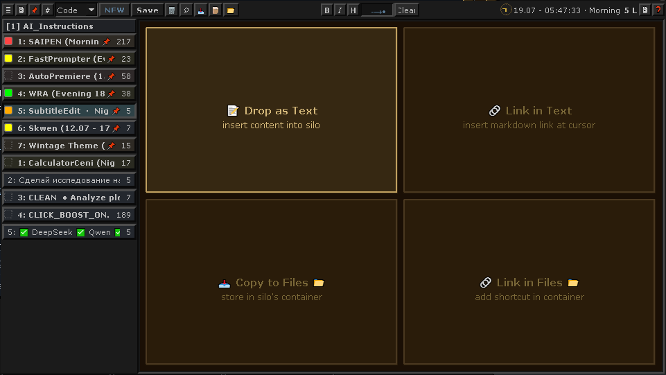
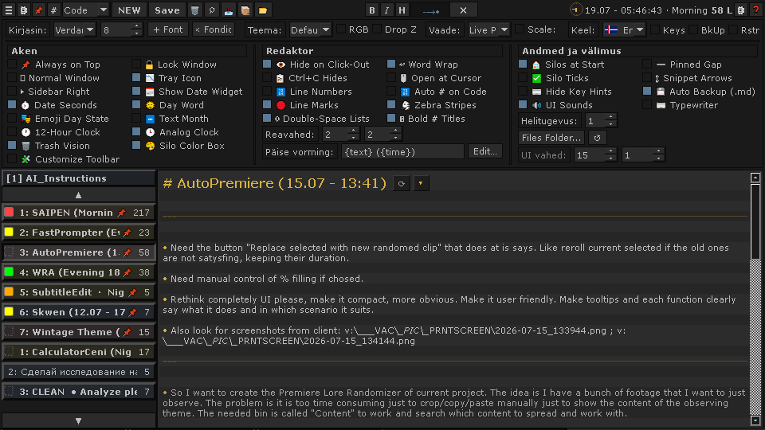
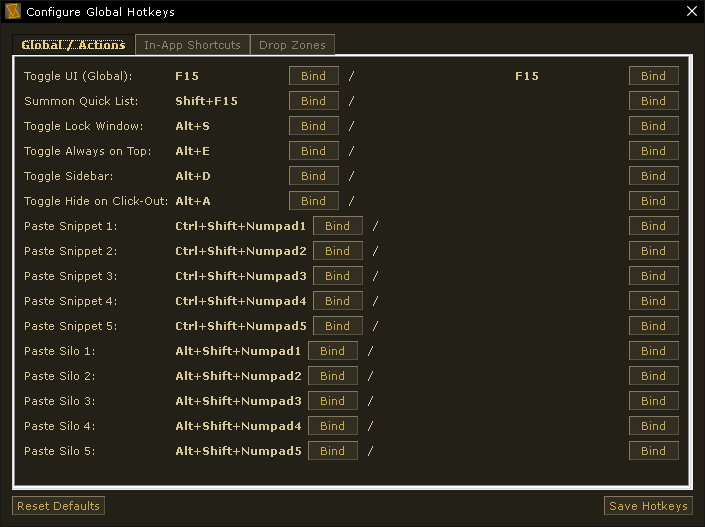

<div align="center">


# FastPrompter

**Keyboard-first, local-first scratchpad & snippet workspace for Windows.**

One global hotkey opens the same local workspace — notes, prompts, commands,
snippets, project scratchpads and small file bundles. No browser, no cloud,
no account.

[Download portable EXE →](https://github.com/vacterro/FastPrompter/releases)

<a href="LICENSE"></a>


Guides: [English](GUIDE_EN.md) · [Русский](GUIDE_RU.md) · [Deutsch](GUIDE_DE.md) · [Eesti](GUIDE_EST.md) · [日本語](GUIDE_JA.md)


<br><em>The main workspace: hierarchical scratchpads on the left, a full Markdown editor on the right, project tabs on top.</em>

</div>

---

## Why FastPrompter

FastPrompter is for text you repeatedly need while working: temporary notes,
prompts, commands, snippets, project scratchpads and small file bundles.
One global hotkey (`Alt+X`) opens the same local workspace from anywhere —
a browser, an IDE, a terminal — without switching to a cloud notebook.
Changed text is saved automatically; there is no save button to remember.

Your data stays yours: primary state lives beside the executable, and nothing
leaves your machine unless you ask it to.

## At a glance

- **Global summon hotkey** — `Alt+X` / `F15` (rebindable, two slots) pops the
  window up at your cursor from any application.
- **Project-oriented organization** — up to 100 project tabs; each holds up to
  100 auto-saved scratchpads ("silos"), 10 `F1`–`F10` snippets, and an archive.
- **Auto-saved hierarchical scratchpads** — silos nest into a tree and support
  pins, completion ticks, recency tints and multi-select; `Ctrl+Z` undoes text
  *and* silo operations.
- **Markdown & code editing** — live highlighting, clickable checkboxes,
  folding, code fences with syntax tints, line numbers and one-click copy.
- **Per-silo file containers** — drop any files into a silo's drawer; it is a
  plain folder on disk, browsable in Explorer without the app.
- **Local-first portable storage** — SQLite (WAL) database, `.bak` rotation,
  daily Markdown snapshots, an optional one-way mirror and a restorable trash.
  No cloud, no account, no telemetry.
- **Optional local automation** — a watcher can queue prompts from a silo and
  send them into a target app when the app is idle.

## Quick start

**Portable EXE (recommended).** Download `FastPrompter.exe` from the
[Releases page](https://github.com/vacterro/FastPrompter/releases), run it,
press `Alt+X`. No install, no Python, no admin rights. Data lives in a `data/`
folder next to the EXE — copy that folder and you have your backup and your
install in one move.

**From source** (Python 3.11+):

```powershell
git clone https://github.com/vacterro/FastPrompter.git
cd FastPrompter
uv sync
uv run python FastPrompter.pyw     # or: pip install -r requirements.txt; python FastPrompter.pyw
```

**Build your own portable EXE** (≈28 MB, unused Qt modules stripped):

```powershell
uv run python tools/build.py
```

## Local-first data & recovery

**Where your data lives.** Primary state is a SQLite database
(`data/local_data_v15.db`) in a `data/` folder beside the executable (falling
back to `%LOCALAPPDATA%\FastPrompter\` if that folder is not writable). Silo
file containers are plain folders under `data/files/<project>/<silo>/`, and
the trash lives at `data/files/_trash/`. There is no cloud, no account and no
telemetry; the core app makes no network calls.

**What leaves the machine.** Nothing by default — no network calls, no
telemetry, no account. Two opt-in features extend beyond the app: the daily
Markdown snapshot folder (written to your local Documents, see below) and the
watcher, which sends queued prompts into a target application you choose and
explicitly arm.

**How it survives.**

- **Transactional saves** — SQLite in WAL mode; every save is a single
  transaction. Changed text is autosaved on a 10-second timer and on hide,
  close and silo/profile switches.
- **Database backup** — a `.bak` copy is taken at startup and refreshed at
  most once a minute after real changes; a fresh or empty database never
  overwrites a healthy backup.
- **Daily Markdown snapshots** — every project's silos, snippets and archive
  are exported as plain `.md` to `Documents\.fastprompter\YYYY-MM-DD\`
  (on by default, at most every 2 minutes, last 7 days kept). Readable without
  FastPrompter.
- **Optional one-way mirror** — point Settings at any folder and silos are
  mirrored there as `.md` as you save. It never reads back and never deletes.
- **Undo across restarts** — the latest undo snapshots are written to
  `<database>_undo.json` and reloaded on the next launch.
- **Trash, not destruction** — clearing or trashing a silo moves its text and
  files into `data/files/_trash/`; the Trash dialog restores them.

The honest failure model lives under [Known limits](#known-limits).

## Engineering evidence

Mechanisms, not marketing:

- **Stack** — Python 3.11, PyQt6, SQLite (standard library), Win32 APIs;
  packaged as a portable single-file EXE with Nuitka.
- **Persistence** — SQLite in WAL mode (`synchronous=NORMAL`) with
  transactional delta saves: only changed rows are written, and snapshots are
  only taken after a commit succeeds (`core/state.py`,
  `utils/portable_backup.py`).
- **Single-instance IPC** — a `QLocalServer` named pipe
  (`FastPrompter_Server_V15`) with a temp-file token and an ACK handshake; a
  second launch hands off to the running instance instead of stacking
  (`core/ipc_server.py`).
- **Two hotkey layers** — Win32 `RegisterHotKey` plus a native event filter
  dispatches global keys with layout-independent VK resolution (QWERTY,
  JCUKEN, AZERTY, QWERTZ); in-app keys are Qt `QShortcut`s. Both layers are
  rebindable with two slots per action (`core/hotkeys.py`,
  `core/hotkey_filter.py`).
- **Custom editor stack** — a `QPlainTextEdit` subclass with a live Markdown
  highlighter, a line gutter with fold arrows, section folding, code-fence
  copy, clickable checkboxes, collapsible image pills, a four-zone file drop
  overlay and hide-markup mode (`ui/editor.py`, `ui/markdown_highlighter.py`).
- **Filesystem-backed containers** — each silo owns a stable, unique folder
  under `data/files/`; rename-safe and recoverable through the trash
  (`ui/file_container.py`).
- **Multi-layer recovery model** — transactional DB + startup/throttled `.bak`
  + daily plain-Markdown snapshots + optional one-way mirror + persisted undo
  + soft-delete trash. Each layer catches a different failure class.
- **Watcher as a finite-state machine** — explicit
  `DISARMED → ARMED → WATCHING → SENDING` states with settle, rate and
  failure boundaries (`core/watcher/engine.py`).
- **Tests** — a unit suite plus a smoke/integration suite that boots the real
  application offscreen; CI runs ruff and the full suite on `windows-latest`
  (see [Development](#development)).

## Core features

### Notes, snippets, projects

- **Silos** — up to 100 auto-saved scratchpads per project; nest into a
  hierarchy, pin, tick, tint by recency, multi-select, middle-click to trash.
- **Snippets** — named text blocks pasted with `F1`–`F10` (or
  `Ctrl+Shift+1`–`0`), with variable placeholders.
- **Projects** — up to 100 tabs, each with its own silos, snippets, archive
  and files; right-click to add/rename/delete, wheel to switch.
- **Search** — multi-word AND matching across silos (`foo bar` finds both).
- **Archive** — one click stores a silo or snippet out of the way, restorable.

### Files & organization

- **File containers** — per-silo plain folders under `data/files/`; drag files
  in/out, preview images, link originals, Explorer-style views.
- **Drop zones** — dragging a file onto the editor offers insert-as-text,
  insert-link, copy-to-Files, or shortcut.
- **Folder templates** — build a predefined structure (IN/OUT, assets, …)
  inside a silo's container with one click.
- **Trash** — middle-click moves a silo (text *and* files) to
  `data/files/_trash/`; nothing is destroyed behind your back.

### Workspace & UI

- **Global hotkeys** (rebindable, two slots each): `Alt+X`/`F15` toggle
  window, `Shift+Alt+X` pie menu, `Alt+E` lock position, `Alt+S` always on
  top, `Alt+D` sidebar, `Alt+A` hide on click-out, `Ctrl+Alt+Shift+Q` quit.
- **Window modes** — frameless, lock-in-place, always-on-top, `Ctrl+Q` snap
  to corners/zones, three-stage zen mode.
- **Themes** — 9 built-in (Win95-style dark-golden, OLED, Dracula, Nord,
  Solarized Dark, …) plus a full custom color editor.
- **Scaling** — the whole UI scales 50–150% (`Ctrl+Plus`/`Ctrl+Minus` for
  fine steps).
- **Extras** — analog clock, date widget, Pomodoro-style timer, optional UI
  sounds with per-event sound settings, and 33 interface languages with
  flag icons (including the bonus «Дед» grandpa voice).

### Optional automation

- **Watcher** — queue prompts from a silo and have them typed into a target
  app when the app is idle. This is a local workflow automation, not a bot:
  you arm it per session against one target you choose. It waits until the
  target is observed idle, sends one prompt at a time with a minimum gap, a
  per-session send cap and a consecutive-failure cutoff, and never persists
  its armed state across restarts. Targets are declared as TOML adapters
  (Claude Code, opencode, freebuff, Antigravity, …) over Win32 message or
  Chromium CDP transports (`core/watcher/`, see the
  [Watcher Engine wiki](https://github.com/vacterro/FastPrompter/wiki/Watcher-Engine-Architecture)).
- **SAIPEN** — FastPrompter previously shipped a small viewer for `.saipen/`
  state files (STATE/BOARD/LOG); it was removed in v0.8.4. The canonical
  SAIPEN protocol lives in its own repository:
  [github.com/vacterro/saipen](https://github.com/vacterro/saipen). The
  watcher above is generic and does not depend on SAIPEN.

## Screenshots

<div align="center">


<br><em>Main workspace — project tabs, silo sidebar and the Markdown editor.</em><br><br>


<br><em>Drop zones — dragging a file onto the editor lets you embed it, link it, or copy it into the silo's folder.</em><br><br>


<br><em>Settings — toggle everything from line numbers to the analog clock.</em><br><br>


<br><em>Global hotkeys — rebind any action to fit your workflow and avoid clashes with other software.</em><br><br>

</div>

More images live in the [Wiki gallery](https://github.com/vacterro/FastPrompter/wiki).

## Development

```powershell
uv sync --group dev
uv run ruff check src/ tests/ tests_smoke/
uv run pytest tests/ tests_smoke/ -q
```

- The suite at v0.8.34 collects **1852 tests** — **1049 unit tests** in
  `tests/` plus **803 offscreen real-app integration/smoke tests** in
  `tests_smoke/` — and runs **1851 passed, 1 skipped** (about 20 minutes).
  The count changes with every release; get the live number with
  `uv run pytest tests/ tests_smoke/ --collect-only -q`.
- CI (GitHub Actions on `windows-latest`) runs ruff and the full test suite on
  every push and pull request; pre-commit runs ruff on commit.
- `mypy`, `pyright` and `bandit` are declared dev dependencies but are not
  currently gating CI or pre-commit.

## Documentation & Wiki

- **Guides** — [English](GUIDE_EN.md) · [Русский](GUIDE_RU.md) ·
  [Deutsch](GUIDE_DE.md) · [Eesti](GUIDE_EST.md) · [日本語](GUIDE_JA.md) — the
  friendly, grandpa-voiced explanation of every feature.
- **[CHANGELOG](CHANGELOG.md)** — version history with the reasoning behind
  each release.
- **[GitHub Wiki](https://github.com/vacterro/FastPrompter/wiki)** —
  [Architecture](https://github.com/vacterro/FastPrompter/wiki/Architecture-Overview),
  [Module Structure](https://github.com/vacterro/FastPrompter/wiki/Module-Structure),
  [Core API](https://github.com/vacterro/FastPrompter/wiki/Core-API-and-Classes),
  [Configuration](https://github.com/vacterro/FastPrompter/wiki/Configuration),
  [Keyboard Shortcuts](https://github.com/vacterro/FastPrompter/wiki/Keyboard-Shortcuts-and-Cheatsheet),
  [User Guide](https://github.com/vacterro/FastPrompter/wiki/User-Guide),
  [Watcher Engine](https://github.com/vacterro/FastPrompter/wiki/Watcher-Engine-Architecture),
  [Deployment](https://github.com/vacterro/FastPrompter/wiki/Deployment-Guide).

**Freshness policy:** the README and the code in `src/` are canonical. Wiki
pages describe the v0.8.x codebase they were written against; when a page
and the code disagree, the code wins.

## Versioning & releases

The version lives in `pyproject.toml`; every release is tagged `v<version>`.
Portable EXE builds are published to the
[Releases page](https://github.com/vacterro/FastPrompter/releases) via
`tools/release.py`. The last published EXE can lag the latest source tag —
check the release date before downloading.

## Known limits

- **Autosave window** — text is written on a 10-second timer plus lifecycle
  events; a forced process kill can lose up to ~10 seconds of typing.
- **Power loss** — SQLite runs with `synchronous=NORMAL`; a sudden power cut
  can cost the most recent transaction. The WAL journal bounds the damage,
  and the daily Markdown snapshots are the archive.
- **`.bak` is a single generation** — a rollback point, not an archive.
- **Snapshots keep 7 days** — older day folders are pruned.
- **Watcher** — detection is best-effort (file/sqlite/window/process probes);
  a wrong reading can cost at most one prompt within a rate-limit window.
  It only ever sends into a target you armed.

## License

MIT — see [`LICENSE`](LICENSE).

---

<sub>Built with Python, PyQt6 and ❤️ by [vacterro](https://github.com/vacterro)</sub>
