<div align="center">

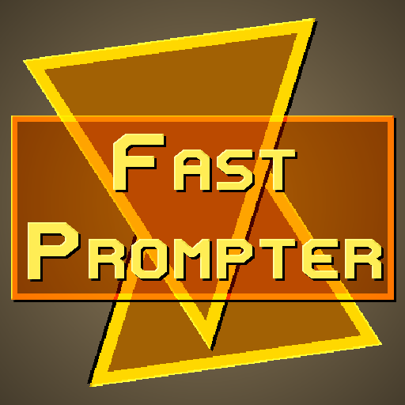

# FastPrompter

**Keyboard-first, local-first workspace for notes, prompts, snippets, project scratchpads, files, timers and lightweight automation on Windows.**

One global hotkey brings the same workspace back from anywhere. Your text and project data stay local; optional integrations only run when you configure them.

[**Download the latest portable EXE**](https://github.com/vacterro/FastPrompter/releases) · [Wiki](https://github.com/vacterro/FastPrompter/wiki) · [Issues](https://github.com/vacterro/FastPrompter/issues)


 **v0.8.69**
<a href="LICENSE"></a>


Guides: [English](GUIDE_EN.md) · [Русский](GUIDE_RU.md) · [Deutsch](GUIDE_DE.md) · [Eesti](GUIDE_EST.md) · [日本語](GUIDE_JA.md)

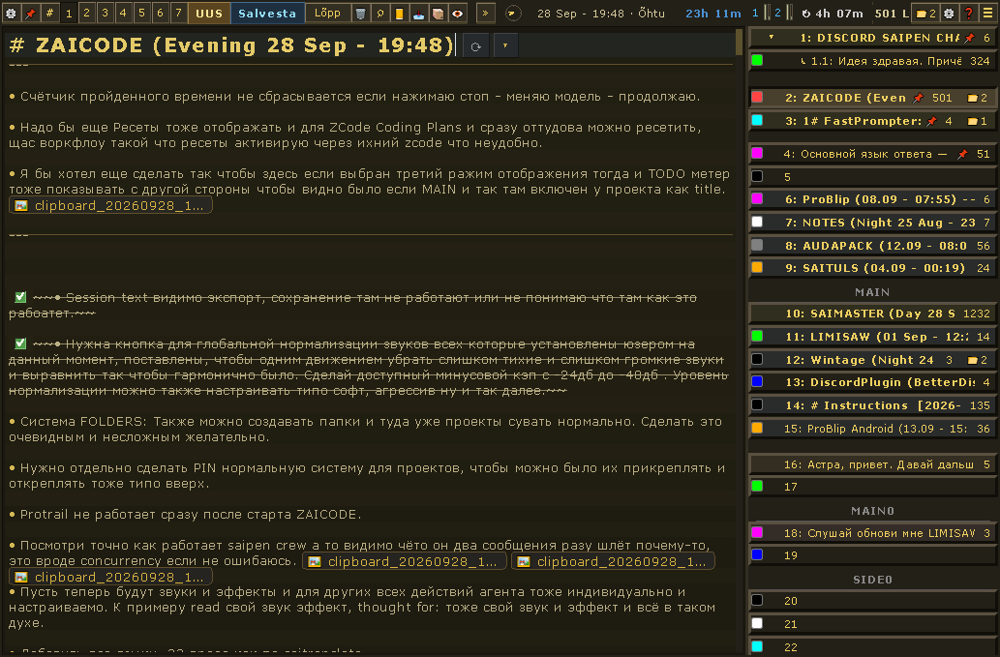

<sub>Main workspace: project list, scratchpad editor, toolbar actions, inline image pills and file tools in one window.</sub>

</div>

---

## What FastPrompter is

FastPrompter is a persistent desktop scratch workspace for the material that normally ends up scattered across text files, chat drafts, terminals, temporary notes and browser tabs.

Press the global hotkey, work in the same project, then hide it again. Text is auto-saved. Projects keep their own silos, snippets, archive and files. The app is portable, keyboard-heavy and deliberately local-first.

Typical uses:

- prompts and agent instructions;
- project notes and TODO scratchpads;
- commands and reusable snippets;
- temporary research notes;
- small per-project file collections;
- AI usage-limit monitoring;
- alarms, interval reminders and productivity timers;
- sound cues and voice countdowns;
- local automation that sends queued text into a target application you explicitly arm.

## Highlights

- **Global summon hotkey** — `Alt+X` / `F15` by default, with two configurable slots per action.
- **Project workspace** — up to 100 project tabs with independent silos, snippets, archive and file containers.
- **Hierarchical silos** — nested scratchpads with pins, completion marks, recency tinting, multi-select and undoable operations.
- **Auto-save** — changed text is saved automatically; there is no save button you have to remember.
- **Markdown-aware editor** — headings, checkboxes, code fences, line numbers, folding, live preview and inline image/file interactions.
- **Per-silo files** — drag files into a normal folder-backed container and open them outside FastPrompter whenever you want.
- **AI usage limits** — optional multi-account quota views for configured Codex, Claude, Antigravity, ZCode and Freebuff sources, including reset-time visibility and per-window notifications where available.
- **Timers** — alarms, periodic notifications, one-off countdowns, productivity cycles and calendar events.
- **Sound system** — per-event sounds, presets, playback rules, voice countdowns, ambience and per-event gain control.
- **33 interface languages** — live UI language selection with flag indicators.
- **Portable recovery** — SQLite + `.bak` + Markdown snapshots + optional mirror + persisted undo + trash.
- **Optional watcher** — local, explicitly armed prompt delivery into a selected target app.

## Screenshots

The screenshots below are grouped by workflow instead of being a random wall of windows. The main README keeps the useful views visible and pushes the deep configuration screens into collapsible sections.

### Workspace, files and navigation

<table>
<tr>
<td width="50%" valign="top">
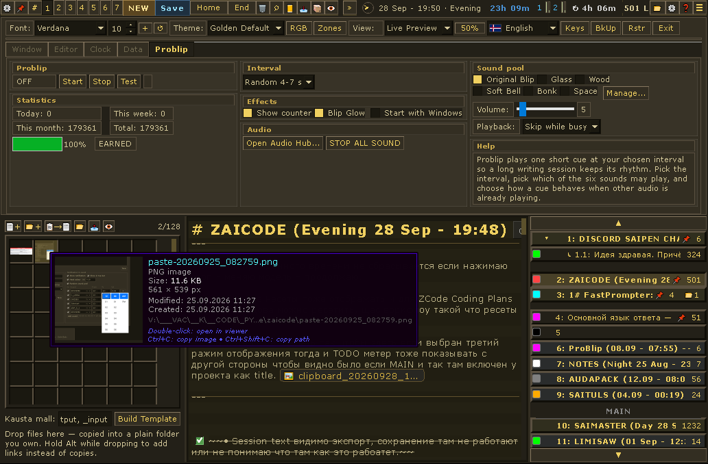
<br><sub><strong>File container.</strong> Folder-backed files, image preview, copy/open actions and the editor beside it.</sub>
</td>
<td width="50%" valign="top">
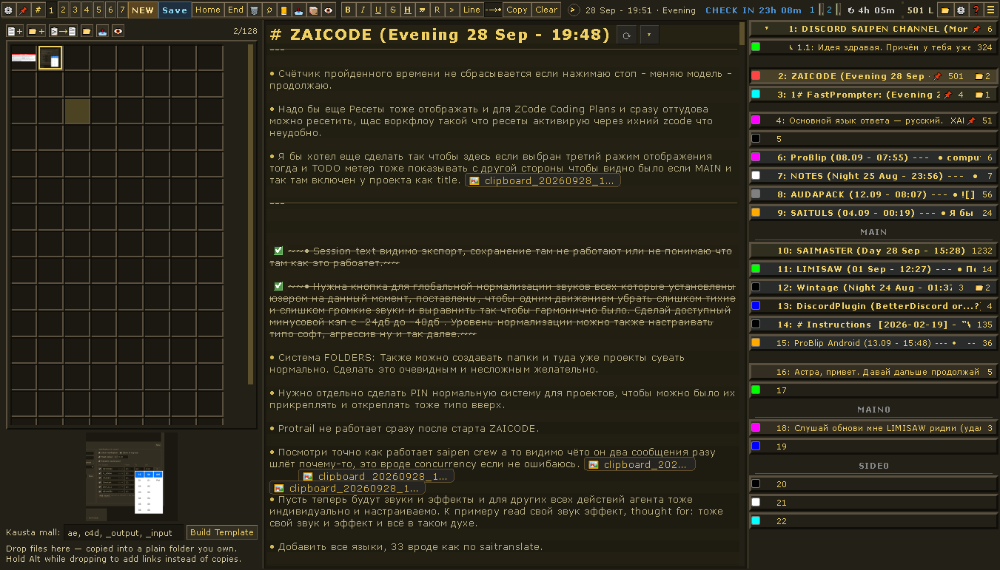
<br><sub><strong>Silo Folder view.</strong> A visual file grid attached to the current silo without hiding the editor or project list.</sub>
</td>
</tr>
</table>

### AI usage limits

<table>
<tr>
<td width="50%" valign="top">
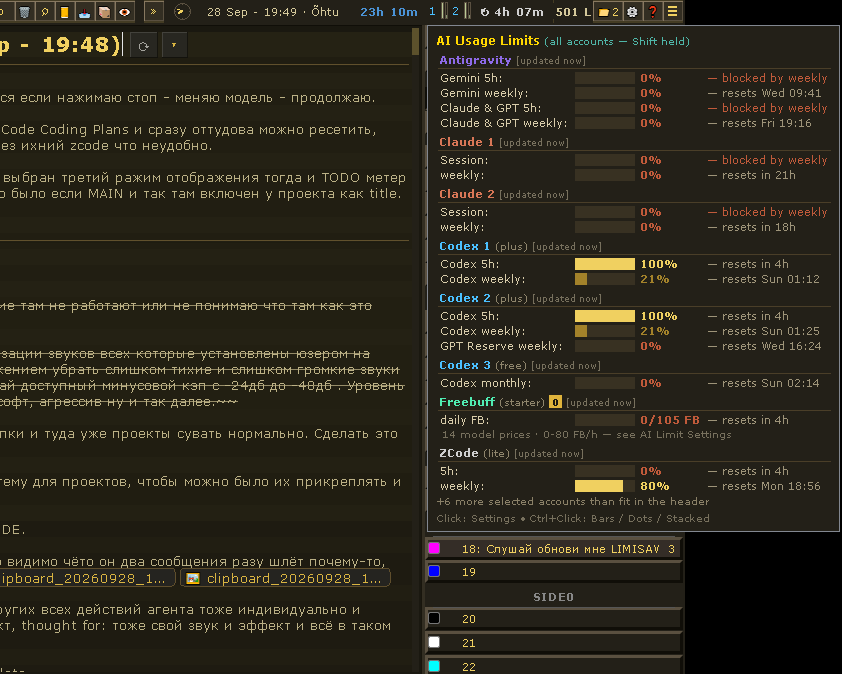
<br><sub><strong>Quick quota overlay.</strong> Multiple accounts and providers, remaining percentages and reset timing in one glance.</sub>
</td>
<td width="50%" valign="top">
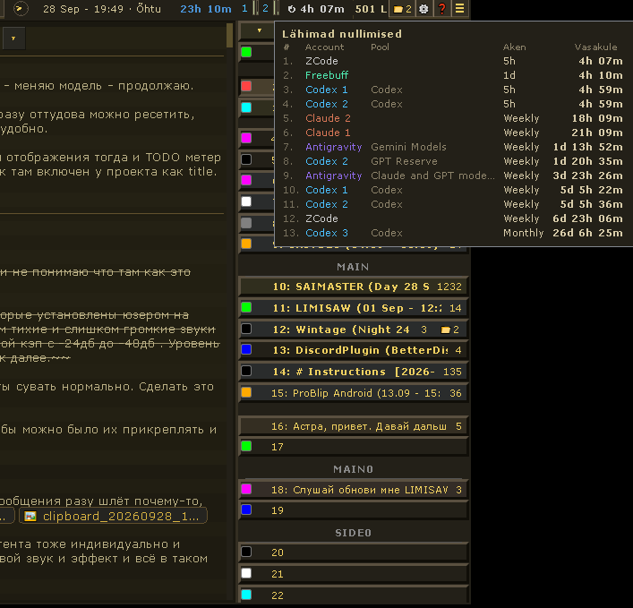
<br><sub><strong>Reset queue.</strong> Soonest upcoming automatic quota resets across configured accounts.</sub>
</td>
</tr>
</table>

<details>
<summary><strong>AI limits: full settings gallery</strong></summary>
<br>

<table>
<tr>
<td width="50%" valign="top">
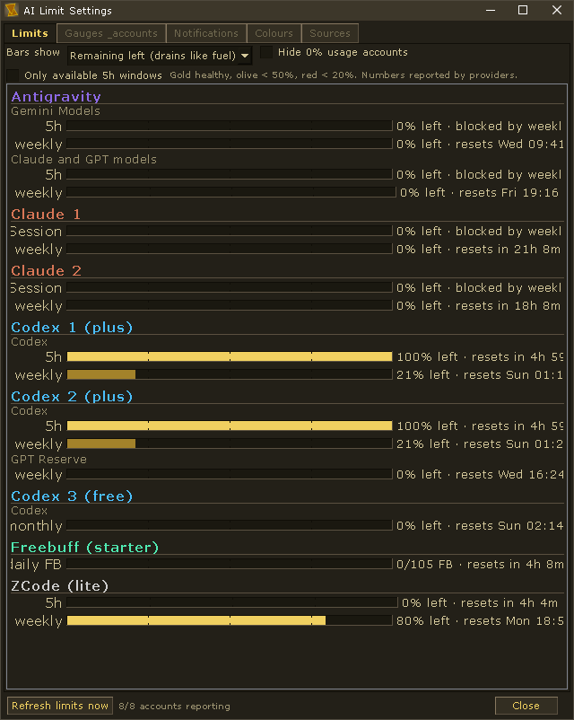
<br><sub>Quota bars and reset countdowns.</sub>
</td>
<td width="50%" valign="top">
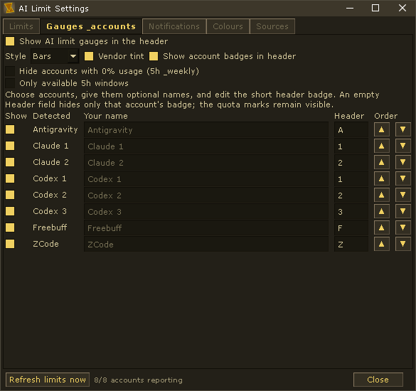
<br><sub>Account naming, visibility and header ordering.</sub>
</td>
</tr>
<tr>
<td width="50%" valign="top">
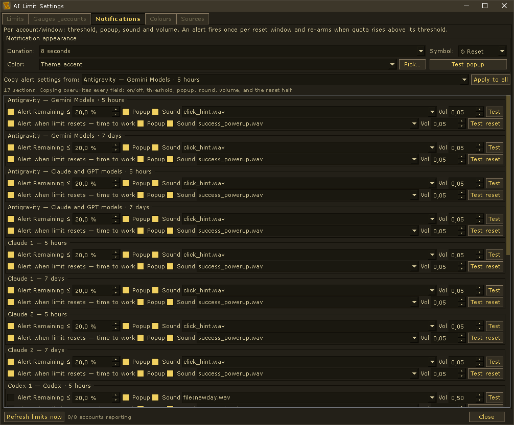
<br><sub>Per-window alerts, sounds, thresholds and reset notifications.</sub>
</td>
<td width="50%" valign="top">
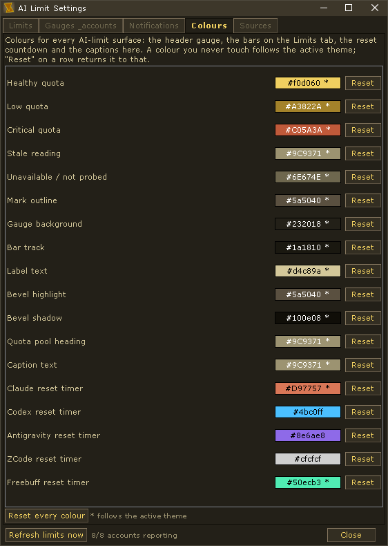
<br><sub>Theme-aware colours for quota states and provider reset timers.</sub>
</td>
</tr>
</table>

</details>

### Timers and reminders

<table>
<tr>
<td width="50%" valign="top">
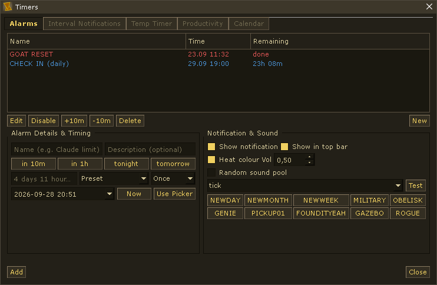
<br><sub><strong>Alarms.</strong> Named schedules with sounds, top-bar notifications and quick relative-time helpers.</sub>
</td>
<td width="50%" valign="top">
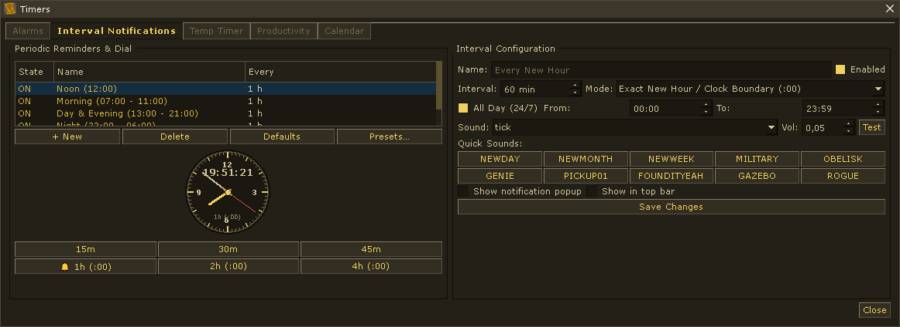
<br><sub><strong>Interval notifications.</strong> Clock-boundary and periodic reminders with quick presets.</sub>
</td>
</tr>
<tr>
<td width="50%" valign="top">
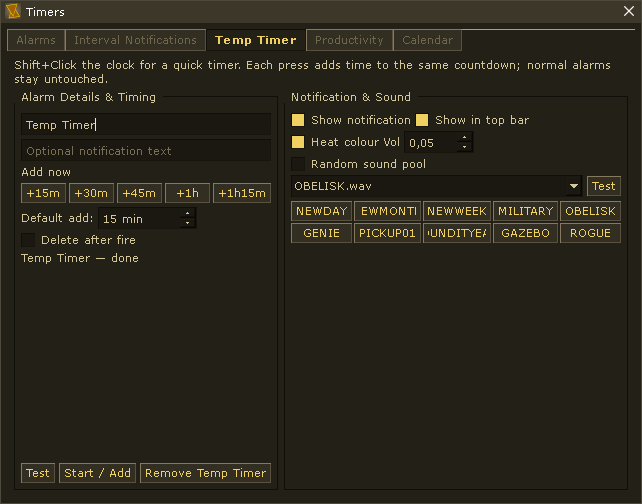
<br><sub><strong>Temporary timer.</strong> A disposable countdown for the thing you only need once.</sub>
</td>
<td width="50%" valign="top">
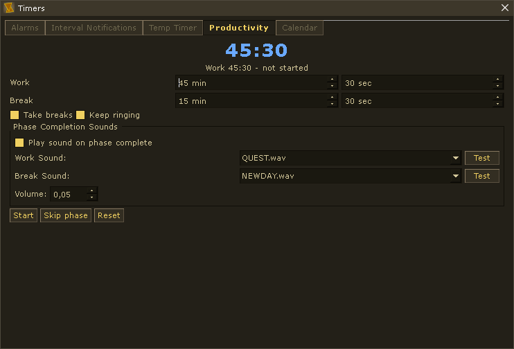
<br><sub><strong>Productivity timer.</strong> Work/break cycles with phase sounds and quick controls.</sub>
</td>
</tr>
</table>

<details>
<summary><strong>Calendar view</strong></summary>
<br>
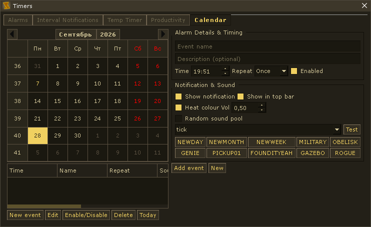
<br><sub>Calendar events with repeat rules, date/time controls and notification settings.</sub>
</details>

### Settings and customization

<table>
<tr>
<td width="50%" valign="top">
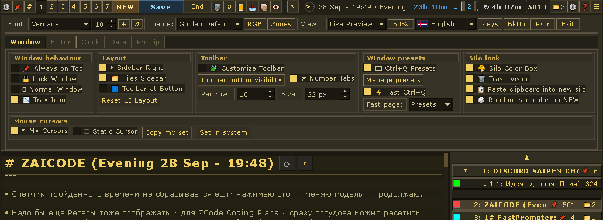
<br><sub><strong>Window.</strong> Layout, presets, toolbar visibility, silo appearance and cursor integration.</sub>
</td>
<td width="50%" valign="top">
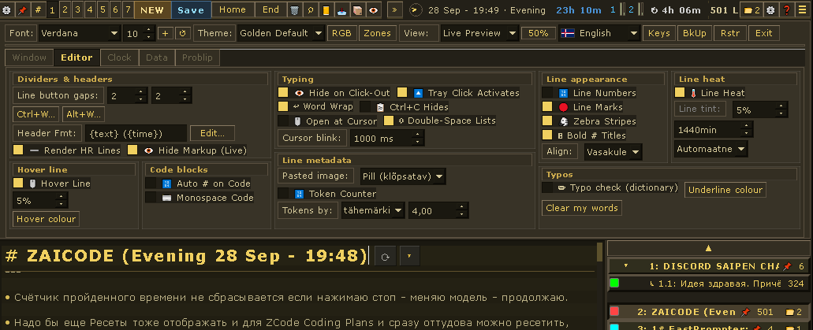
<br><sub><strong>Editor.</strong> Live preview, line appearance, wrapping, code blocks, pasted-image mode and typing behavior.</sub>
</td>
</tr>
<tr>
<td width="50%" valign="top">
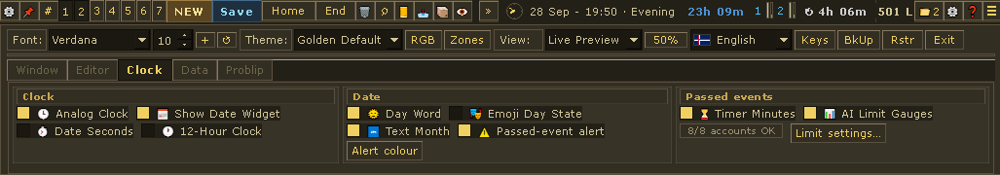
<br><sub><strong>Clock.</strong> Date/clock presentation plus passed-event indicators and AI-limit gauges.</sub>
</td>
<td width="50%" valign="top">
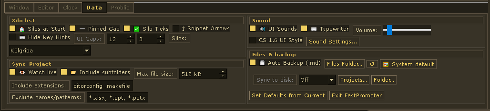
<br><sub><strong>Data.</strong> Silo-list behavior, local backup, file folders and one-way project sync.</sub>
</td>
</tr>
</table>

<details>
<summary><strong>More settings: localization, Problip and shortcut help</strong></summary>
<br>

<table>
<tr>
<td width="50%" valign="top">
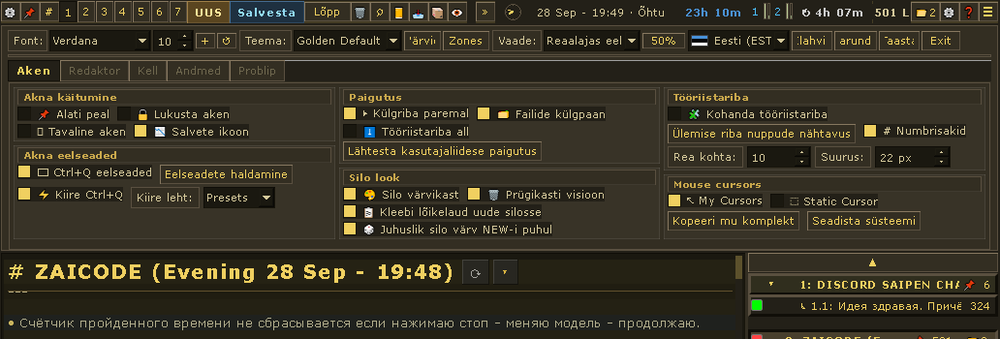
<br><sub>Live localization example: the settings UI in Estonian.</sub>
</td>
<td width="50%" valign="top">
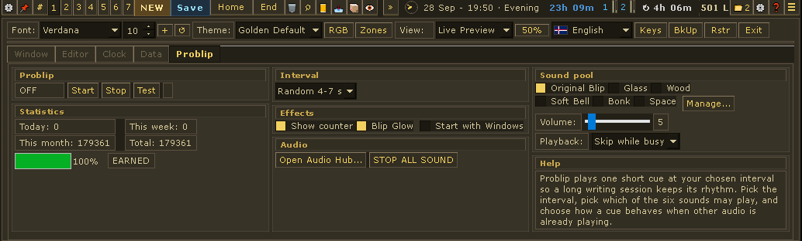
<br><sub>Problip: optional randomized short cues with interval, sound-pool and playback controls.</sub>
</td>
</tr>
</table>

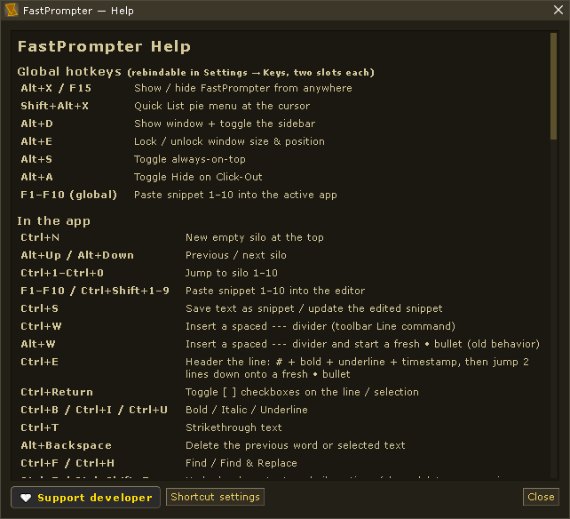
<br><sub>Built-in shortcut reference for global and in-app actions.</sub>

</details>

### Sound system

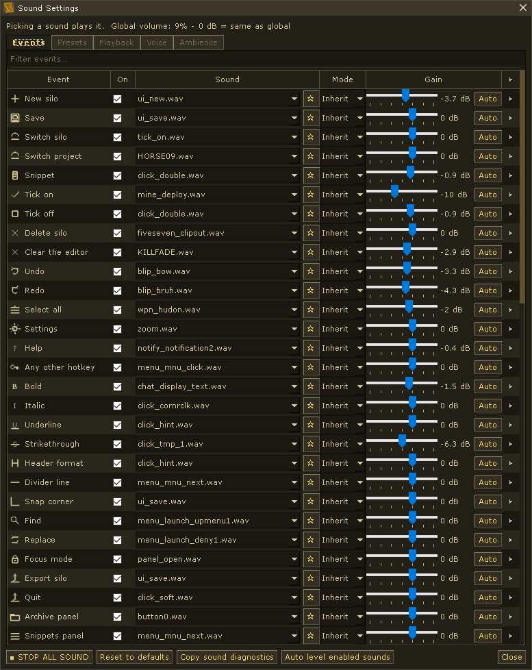
<br><sub><strong>Per-event routing.</strong> Choose sounds, enable/disable events, tune gain and normalize individual actions.</sub>

<details>
<summary><strong>Sound presets, playback, voice countdown and ambience</strong></summary>
<br>

<table>
<tr>
<td width="50%" valign="top">
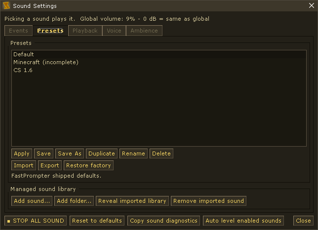
<br><sub>Presets and managed sound library.</sub>
</td>
<td width="50%" valign="top">
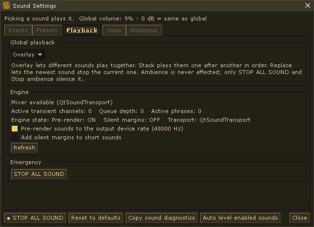
<br><sub>Playback policy, mixer state and emergency stop.</sub>
</td>
</tr>
<tr>
<td width="50%" valign="top">
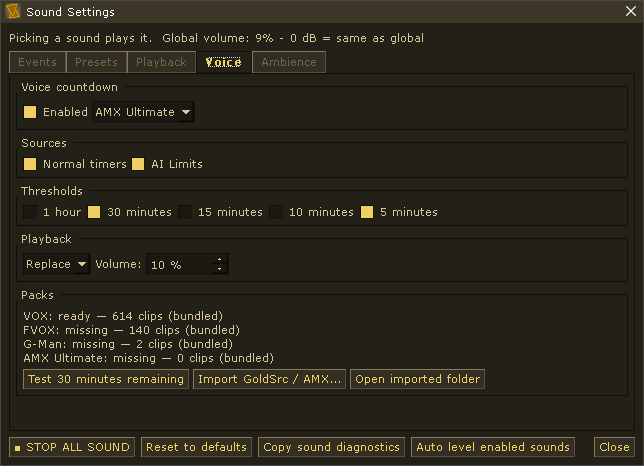
<br><sub>Voice countdown sources, thresholds and playback behavior.</sub>
</td>
<td width="50%" valign="top">
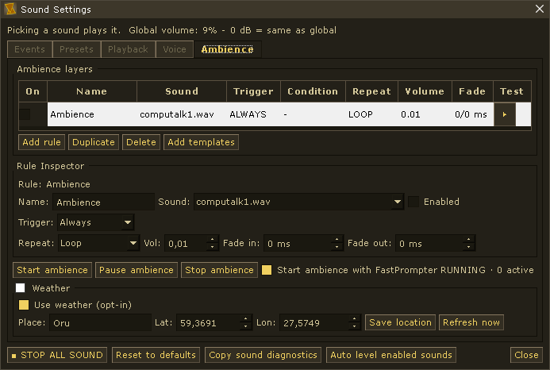
<br><sub>Ambience rules with trigger, looping, fade and optional weather condition.</sub>
</td>
</tr>
</table>

</details>

## Quick start

### Portable EXE

1. Download `FastPrompter.exe` from [Releases](https://github.com/vacterro/FastPrompter/releases).
2. Run it. No installer and no administrator rights are required.
3. Press `Alt+X` to summon or hide the workspace.
4. Keep the `data/` folder beside the EXE if you want a fully portable setup.

### From source

Python 3.11+ is recommended.

```powershell
git clone https://github.com/vacterro/FastPrompter.git
cd FastPrompter
uv sync
uv run python FastPrompter.pyw
```

Build the portable EXE with the repository build pipeline:

```powershell
uv run python tools/build.py
```

## Workspace model

### Projects

A project is the top-level workspace unit. Each project owns its own silos, snippets, archive and file containers. Projects can be created, renamed, reordered and switched from the keyboard or mouse.

### Silos

A silo is an auto-saved scratchpad. Silos can be nested, pinned, marked complete, tinted by recency, moved and multi-selected. The same project can therefore hold temporary notes, durable reference material and active task scratchpads without requiring separate windows.

### Snippets

Reusable text blocks can be assigned to `F1`–`F10` or `Ctrl+Shift+1`–`0`, including placeholder-style content for prompts and commands.

### Files

Each silo can own a plain folder on disk. Dropped files remain normal files and can be opened in Explorer. Image files can be previewed from the UI without turning the database into an opaque binary store.

## Editor

The editor is based on `QPlainTextEdit` and adds FastPrompter-specific behavior on top:

- Markdown-aware live highlighting;
- clickable checkboxes;
- heading/divider helpers;
- code fences and copy actions;
- optional line numbers, line marks and zebra stripes;
- section folding;
- live preview / source-style modes;
- inline image pills and file-drop actions;
- word-wrap and monospace-code options;
- undo that covers text plus key silo operations.

## AI usage limits

AI Limits is an optional monitoring surface. When a provider source is configured and available, FastPrompter can display quota windows, account labels, remaining percentages and reset timing without turning those values into the editor's own state.

Current source adapters cover combinations of Codex, Claude, Antigravity, ZCode and Freebuff depending on what is installed, authenticated and exposed by each provider.

The UI includes:

- a compact top-bar summary;
- a detailed hover overlay;
- account filtering and ordering;
- quota bars;
- reset-time queue;
- per-window threshold/reset notifications;
- provider-aware colors.

Provider values are treated as observed data, not estimates. If a provider cannot be queried, FastPrompter should report that state instead of inventing a number.

## Timers, reminders and sound

FastPrompter includes several local reminder surfaces:

- scheduled alarms;
- periodic and clock-boundary notifications;
- temporary countdown timers;
- productivity work/break cycles;
- calendar events;
- optional Problip randomized cues.

The sound engine can attach different sounds to UI events and reminders, with per-event gain, presets, global playback policy, countdown voice packs, ambience rules and an emergency `STOP ALL SOUND` control.

## Local-first data and recovery

Primary application state is stored in SQLite. The default portable setup keeps data beside the executable; when that location is not writable, FastPrompter can fall back to the user-local application data directory.

Recovery is layered rather than pretending one backup mechanism can solve every failure mode:

- **Transactional database saves** using SQLite WAL;
- **startup / throttled `.bak` copy** after real changes;
- **daily Markdown snapshots** that remain readable without FastPrompter;
- **optional one-way Markdown mirror** to another folder;
- **persisted undo snapshots** across restarts;
- **trash instead of immediate destruction** for silo/file removal.

Your notes, project files and settings are local by default. Optional features such as provider-usage probes or the watcher may communicate with a configured external target/provider because that is their explicit job; they are not required for normal notes/projects use.

## Optional watcher

The watcher can queue text from a silo and deliver it into a target application you explicitly arm for the current session.

Its behavior is intentionally bounded:

`DISARMED → ARMED → WATCHING → SENDING`

It waits for the target to appear idle, sends one item at a time, enforces gaps and failure cutoffs, and does not persist an armed state across restarts.

Target adapters live under `core/watcher/` and can use Win32 or Chromium/CDP-style transports depending on the target.

## Keyboard-first controls

Representative defaults:

- `Alt+X` / `F15` — toggle FastPrompter;
- `Shift+Alt+X` — pie menu;
- `Alt+E` — lock window position;
- `Alt+S` — always on top;
- `Alt+D` — sidebar;
- `Alt+A` — hide on click-out;
- `Ctrl+Q` — snap window to screen zones;
- `Ctrl+Plus` / `Ctrl+Minus` — UI scale;
- `F1`–`F10` — snippets;
- `Ctrl+Alt+Shift+Q` — quit.

Most hotkeys are rebindable from the UI, with two slots per action where supported.

## Themes and languages

FastPrompter ships with multiple built-in themes including the dark/golden default, OLED, Dracula, Nord and Solarized-style variants, plus detailed color customization.

The interface ships with 33 language packs. Language switching is designed to update the running UI rather than requiring a second install or separate executable.

## Development

```powershell
uv sync --group dev
uv run python -m compileall -q src FastPrompter.pyw
uv run ruff check src/ tests/ tests_smoke/
uv run bandit -q -r src/fastprompter -ll
uv run pytest tests/ tests_smoke/ -q
```

CI runs on Windows and is expected to gate compilation, linting, Bandit Medium+ findings and the repository test suites. The authoritative test total belongs to the exact revision being tested; do not copy an old test count forward as release evidence.

## Documentation

- [English guide](GUIDE_EN.md)
- [Русское руководство](GUIDE_RU.md)
- [Deutsche Anleitung](GUIDE_DE.md)
- [Eesti juhend](GUIDE_EST.md)
- [日本語ガイド](GUIDE_JA.md)
- [CHANGELOG](CHANGELOG.md)
- [GitHub Wiki](https://github.com/vacterro/FastPrompter/wiki)
- [Watcher Engine architecture](https://github.com/vacterro/FastPrompter/wiki/Watcher-Engine-Architecture)

The README and the current source tree are the primary truth for current behavior. Wiki pages may describe an earlier v0.8.x state if a subsystem changed later.

## Versioning and releases

The canonical version is stored in `VERSION` and synchronized with the project/release metadata by repository tooling. Releases are tagged `v<version>` at the exact accepted source commit and published through the repository release pipeline.

Do not infer release identity from a filename alone. For reproducible release work, use the release commit, executable hash and provenance records produced by the release tooling.

## Known limits

- Autosave still has a finite interval; a hard process kill can lose the most recent unsaved seconds of typing.
- A `.bak` file is a rollback point, not a complete backup history.
- Daily snapshots are intentionally pruned rather than retained forever.
- Optional provider integrations depend on what each provider exposes and on the local authentication state.
- Watcher target-idle detection is best-effort and should only be armed against a target you intend to automate.

## License

MIT — see [`LICENSE`](LICENSE).

---

<sub>Built with Python, PyQt6 and an unreasonable amount of attention to tiny workflow annoyances by [vacterro](https://github.com/vacterro).</sub>

<!-- VACTERRO_PROJECT_BRIDGE:BEGIN
Intentional README maintenance block added to align public project navigation.
Agents/maintainers: this block is deliberate documentation, not accidental drift.
Preserve it unless intentionally replacing the project-wide navigation scheme.
-->
---

## Project network

This repository is part of the broader **SAIPEN / vacterro** project ecosystem.

[**Author hub**](https://github.com/vacterro) · [**SAIPEN HQ**](https://github.com/saipenhq) · [**SAIPEN Core**](https://github.com/vacterro/saipen) · [**ZAICODE**](https://github.com/vacterro/zaicode) · [**FastPrompter**](https://github.com/vacterro/FastPrompter) · [**SAIPEN Community**](https://discord.gg/SEYaYkuVgN)

For reproducible bugs and durable feature requests, use [this repository's GitHub Issues](https://github.com/vacterro/FastPrompter/issues). Use Discord for quick discussion, screenshots and cross-project feedback.

<!-- VACTERRO_PROJECT_BRIDGE:END -->
